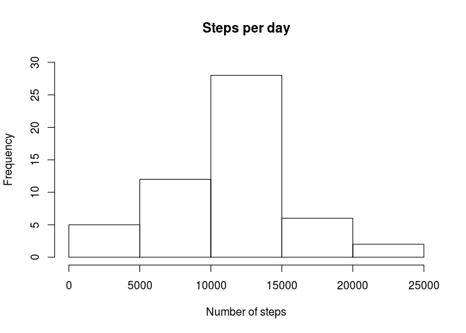
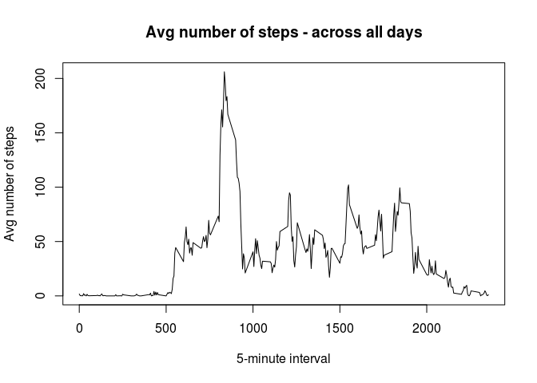
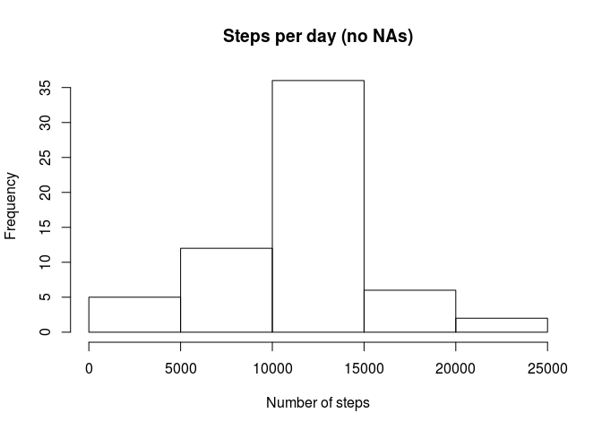
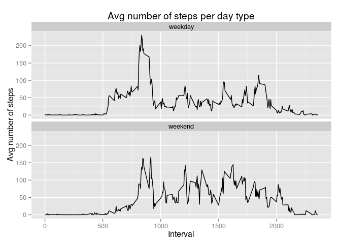

# Reproducible Research: Peer Assessment 1


## Loading and preprocessing the data

Load the raw data into a dataframe named df.


```r
df <- read.csv ("activity.csv", stringsAsFactors = FALSE)
```

Transform date into a proper data type


```r
df <- transform(df, date = as.Date(df$date))
```

Remove rows with NAs


```r
dfClean <- df[complete.cases(df), ]
```

## What is mean total number of steps taken per day?

Sum steps by day


```r
dfDay <- aggregate(df$steps ~ df$date, df, sum)
colnames(dfDay) <- c("date", "steps")
```

Sum steps by day and interval


```r
library(plyr) # Load plyr library
dfDayInterval <- ddply(dfClean, c("date", "interval"), function(dfComplete)sum(dfComplete$steps))
colnames(dfDayInterval) <- c("date", "interval", "steps")
```

Prepare the distribution of steps


```r
hist(dfDay$steps, main = "Steps per day", ylim = c(0, 30), xlab = "Number of steps")
```

 

Prepare the mean and median of steps


```r
meanSteps <- mean(dfDay$steps)
medSteps <- median(dfDay$steps)
```

**The mean equals 1.0766189\times 10^{4}, the median equals 10765. Practically no difference**

## What is the average daily activity pattern?

Time series plot,  averaged across all days


```r
dfAvg <- aggregate(df$steps ~ df$interval, df, mean)
colnames(dfAvg) <- c("interval", "steps")

plot(dfAvg$interval, dfAvg$steps, type = "l", main = "Avg number of steps - across all days", xlab = "5-minute interval", ylab = "Avg number of steps")
```

 

Interval with the maximum number of steps


```r
maxSteps <- dfAvg[which(dfAvg$steps == max(dfAvg$steps)), 1]
```

**Interval with the maximum number of steps is 835.**

## Imputing missing values

Missing values in the dataset


```r
rowNA <- nrow(df) - nrow(dfClean)
```

**Missing values in the dataset is 2304.**

The strategy for filling in missing values. Avg values used.


```r
dfMerged <- merge(df, dfAvg, by = "interval")
dfMerged <- dfMerged[order(dfMerged$date, dfMerged$interval), ]
colnames(dfMerged) <- c("interval", "steps", "date", "meanSteps")

for(i in 1:nrow(dfMerged)) {
  if(is.na(dfMerged$steps[i])) {
    dfMerged$steps[i] <- dfMerged$meanSteps[i]
  }
}
```

Completed data frame with the histogram, mean and median. A copy of the steps above with a completed data frame


```r
dfCompleted <- cbind.data.frame(dfMerged$steps, dfMerged$date, dfMerged$interval)
colnames(dfCompleted) <- c("steps", "date", "interval")

meanStepsCompleted <- mean(dfCompleted$steps)
medStepsCompleted <- median(dfCompleted$steps)
```

Calculate data for plots with no NAs, values for comparisons with the original dataset


```r
dfCompletedDaily <- aggregate(dfCompleted$steps ~ dfCompleted$date, dfCompleted, sum)
colnames(dfCompletedDaily) <- c("date", "steps")

hist(dfCompletedDaily$steps, main = "Steps per day (no NAs)", xlab = "Number of steps")
```

 

```r
dfCompletedAvg <- aggregate(dfCompleted$steps ~ dfCompleted$date, FUN = "mean")
colnames(dfCompletedAvg) <- c("date", "steps")
        
dfCompletedMedian <- aggregate(dfCompleted$steps ~ dfCompleted$date, FUN = "median")
colnames(dfCompletedMedian) <- c("date", "steps")
```

**Number of steps without NAs is 1.0766189\times 10^{4} and after completing 37.3825996. The median with NAs is 10765 and after completing 0.**

**Practically no difference. Slighly bigger difference in median.**

## Are there differences in activity patterns between weekdays and weekends?

Define "weekday" and "weekend"


```r
daysOfWeek <- weekdays(dfCompleted$date)
daysOfWeek <- gsub("poniedziałek", "weekday", daysOfWeek) #MON
daysOfWeek <- gsub("wtorek", "weekday", daysOfWeek) #TUE
daysOfWeek <- gsub("środa", "weekday", daysOfWeek) #WED
daysOfWeek <- gsub("czwartek", "weekday", daysOfWeek) #THU
daysOfWeek <- gsub("piątek", "weekday", daysOfWeek) #FRI
daysOfWeek <- gsub("sobota", "weekend", daysOfWeek) #SAT
daysOfWeek <- gsub("niedziela", "weekend", daysOfWeek) #SUN

daysOfWeek <- as.data.frame(daysOfWeek)
dfDays <- cbind.data.frame(dfCompleted, daysOfWeek)
```

Do the plot taking into account each day


```r
dfAvgPlot <- ddply(dfDays, c("interval", "daysOfWeek"), function(dfFinal) mean(dfFinal$steps))
colnames(dfAvgPlot) <- c("interval", "daysOfWeek", "steps")

library(ggplot2)
        
p <- ggplot(dfAvgPlot, aes(x = interval, y = steps, group = daysOfWeek)) + geom_line() + facet_wrap( ~ daysOfWeek, ncol = 1) +  ggtitle("Avg number of steps per day type") + xlab("Interval") + ylab("Avg number of steps")

print(p)
```

 
